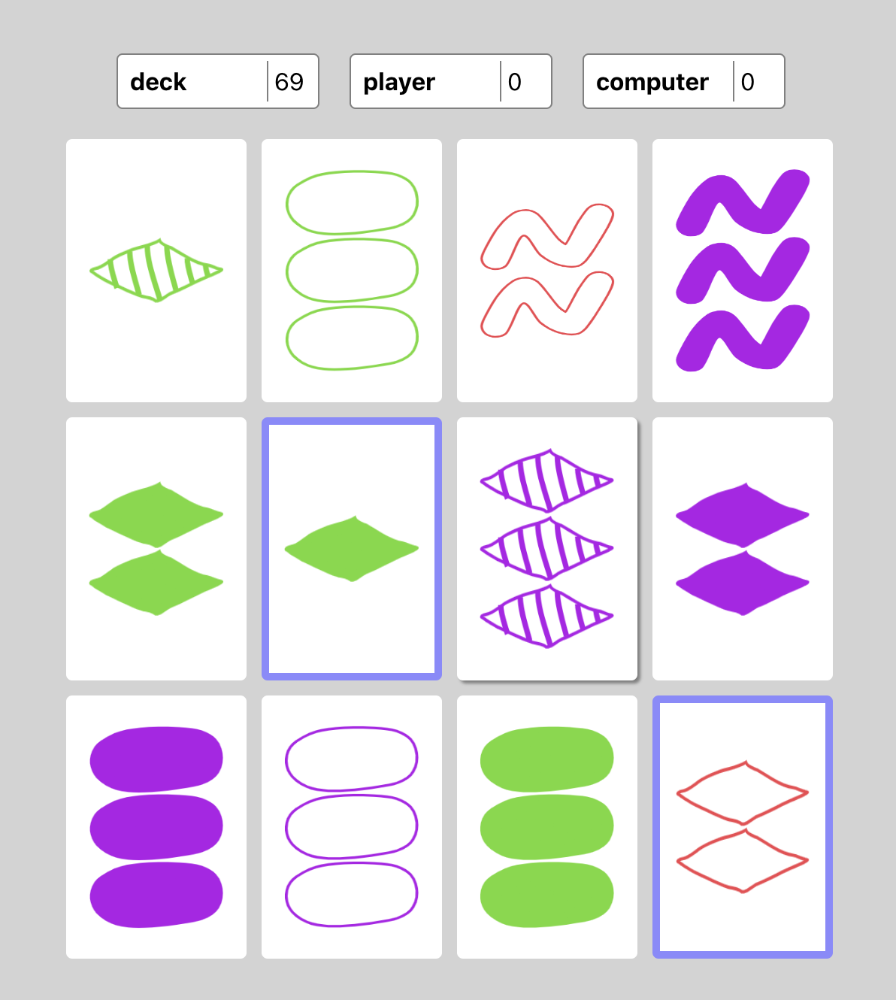

# Set Game

Built the game of Set [(wiki)](<https://en.wikipedia.org/wiki/Set_(card_game)>) leveraging a thought experiment about using regular Javascript classes to implement complex state in React applications. This game is an example of using a state manager without reference to framework specifics in React, Zustand, etc. See more details on how and why to use `useVanillaState` in [this repo](https://github.com/jaimefps/use-vanilla-state).

## How to

```
$ git clone ...
$ cd set-game
$ yarn install
$ yarn start
```

## Preview


