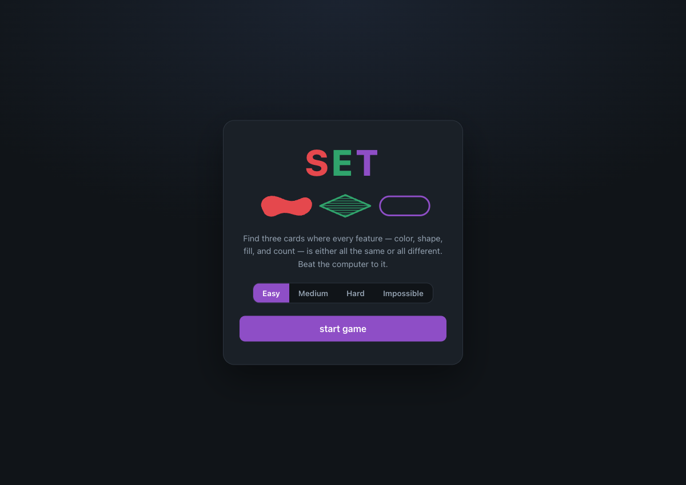
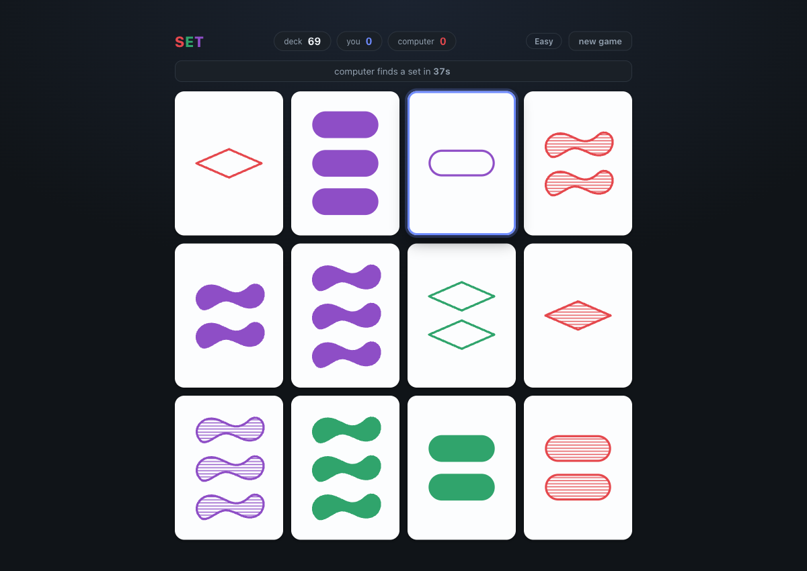
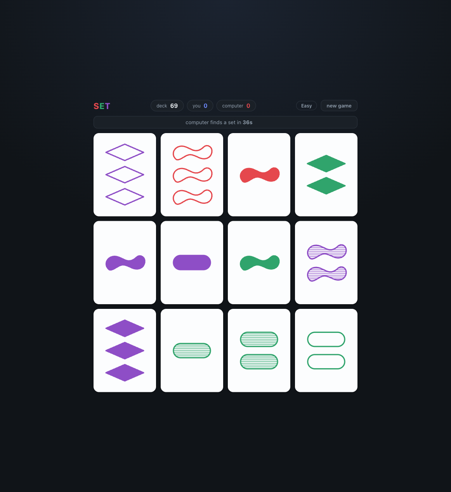
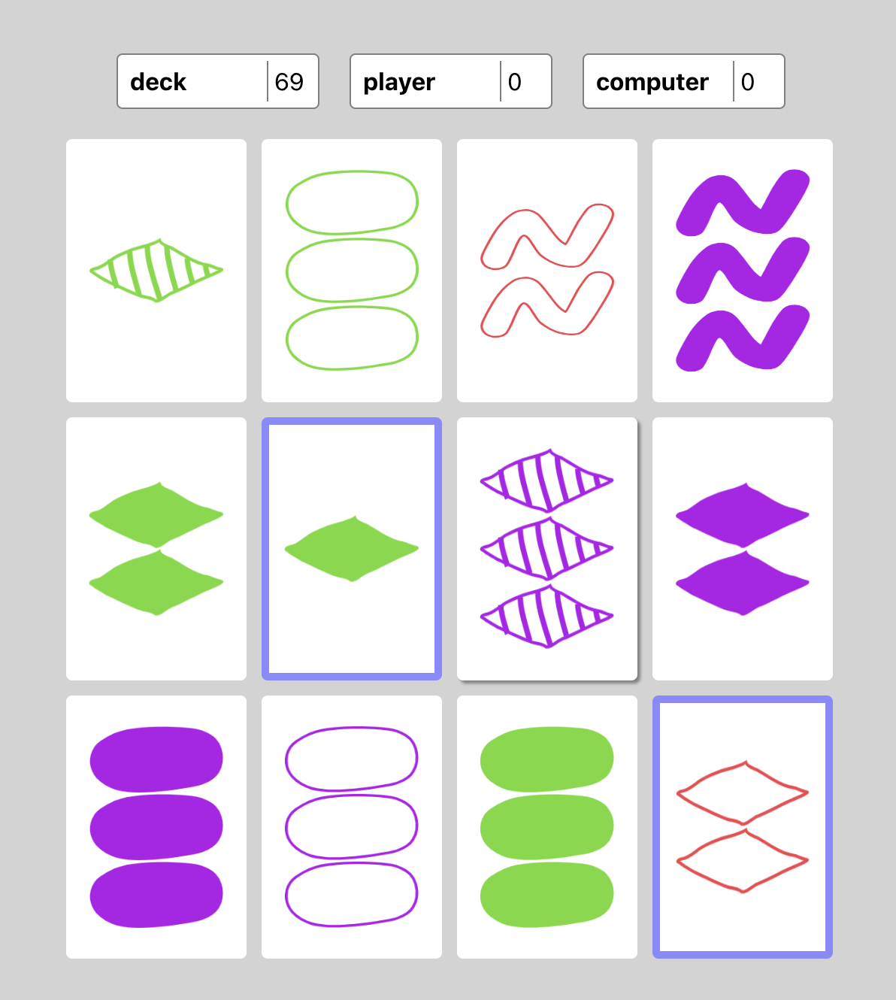

# Set Game

Built the game of Set [(wiki)](<https://en.wikipedia.org/wiki/Set_(card_game)>) leveraging a thought experiment about using regular Javascript classes to implement complex state in React applications. This game is an example of using a state manager without reference to framework specifics in React, Zustand, etc. See more details on how and why to use `useVanillaState` in [this repo](https://github.com/jaimefps/use-vanilla-state).

## How to

```
$ git clone ...
$ cd set-game
$ yarn install
$ yarn start
```

## Preview





## UI redesign (built with Claude)

The game logic is the original hand-written implementation: `GameState`,
the computer-opponent hooks, and the `useVanillaState` architecture that
this repo exists to demonstrate are untouched (aside from additively
recording captured sets). The presentation layer was redesigned with
Claude:

| | Before (original repo) | After (Claude redesign) |
| --- | --- | --- |
| Card art | 27 PNG images, one per color/shape/fill | Single inline SVG component, crisp at any size |
| Theme | Plain light-gray page | Dark table theme, score chips, tri-color logo |
| Feedback | Rotated PNG banners ("nope", "you win"…) | Animated toast banners + game-over panel with score |
| Start screen | Bare `<select>` + start button | Logo, rules blurb, segmented difficulty picker |
| Computer timer | Plain text line + PNG "+time" image | Status pill with warning/danger states + "+3s" chip |
| Layout | Fixed-width board, clips in short windows | Always fits the viewport at any window size |
| Score history | Not available | Click the you/computer pills to review every captured set |

The original UI, for comparison:


